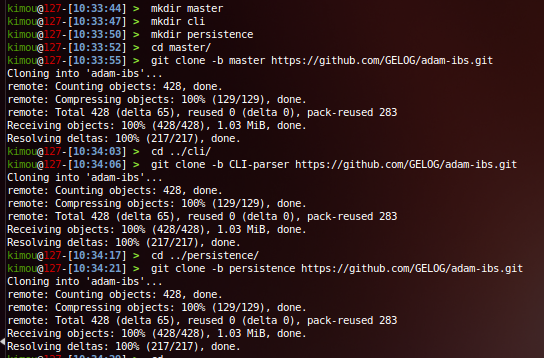
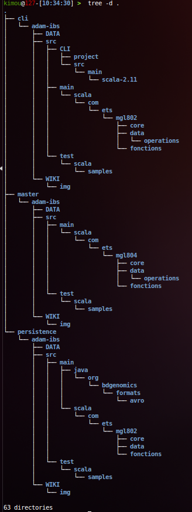

# Adam IBS
[                 ](https://waffle.io/gelog/adam-ibs)

This project ports the IBS/MDS/IBD functionality of PLink to Spark / ADAM.

## Getting started
Checkout our [wiki](https://github.com/GELOG/adam-ibs/wiki)

## Cloner les branches en locale
Valable pour une machine (Mac|Linux) avec package GIT installé

Apercu structure des dossiers

## Begin with code
CLI parser is integrated to code.

1. View CLI options (--help) :

Options Implemented :

 * --help
 
 * --file
 
 * --out
 
 * --make-bed

2. Exemple : Execute --make-bed on --file and get a parquet output file --out

Output parquet files are generated in ./DATA/avro :

