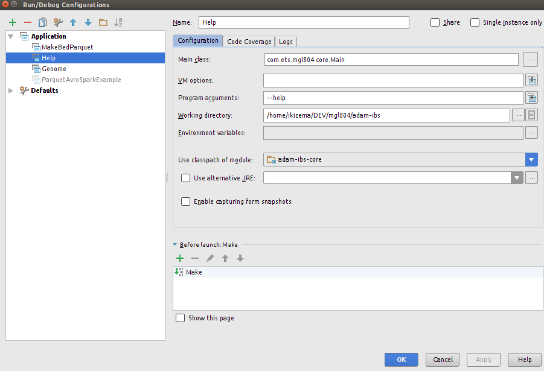
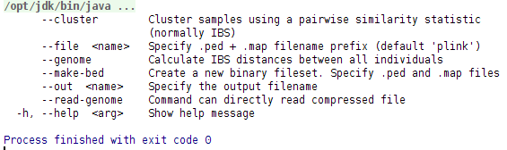
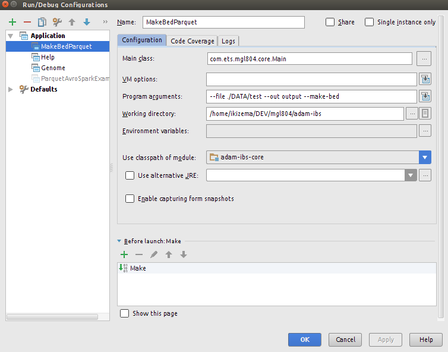
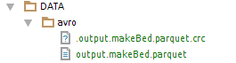

# Adam IBS
[                 ](https://waffle.io/gelog/adam-ibs)

This project ports the IBS/MDS/IBD functionality of PLink to Spark / ADAM.

## Getting started
Checkout our [wiki](https://github.com/GELOG/adam-ibs/wiki)

## Requis :
Mac : Java 1.6

Linux : Java 1.7

Scala : 2.10

## Begin with code
CLI parser is integrated to code.

1. View CLI options (--help) :

Options Implemented :

 * --help
 
 * --file
 
 * --out
 
 * --make-bed

2. Exemple : Execute --make-bed on --file and get a parquet output file --out

Output parquet files are generated in ./DATA/avro :

## Logging
Nous utilisons logback pour le logging. Loggback est le successeur du populaire log4j qui n'est plus supporté.
Logback est composé de 3 composants : 

 * logback-core
 
 * logback-classic (qui est une implementation de SLF4J et une amelioaration de log4j)
 
 * logback-access (pour utilisation evelouée)

Pour utiliser logback pour scala dans un projet maven, il faut ajouter la dependance logback-core. Cette dependance incluera les packages suivants : logback-classic, log4j, slf4j

NB : Il faut absoulment exclure le package sl4j du package apache.spark, la raison est que apache.spark utilise slf4j, lequel est utilisé egalement par logback.

Utilisation : 
import org.slf4j.LoggerFactory // importer le package

def logb = LoggerFactory.getLogger(this.getClass()) // creer une instance, pour la classe a loguer
 
logb.info("hello world") // loguer avec level INFO

Il y a 5 level, qui sont dans l'ordre  Trace, Debug, Info, Warn, Error

Il faut creer un fichier config : src/scala/ressources/logback.xml, dans lequel on defint :
 
 * l'appender : la sortie : console, fichier, ou autre
 
 * layout : affichage
 
 * level.
 
Pour le level, on peut definir un niveau minimum a logguer. Exemple, si on décide que le niveau le plus bas est : INFO, donc tous les log de type : Debug, Trace, ne seront pas affichés

On peut egalement, desactivé les log pour un package en particulier
